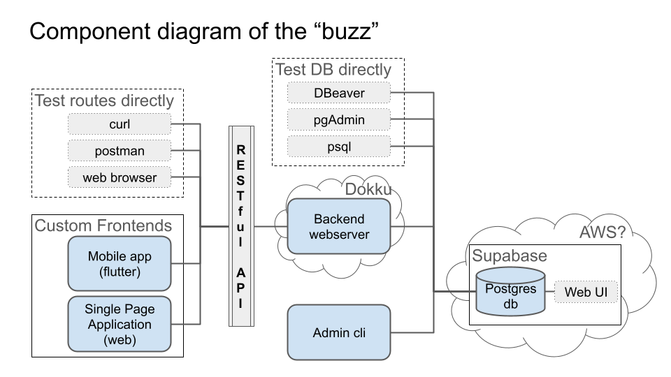
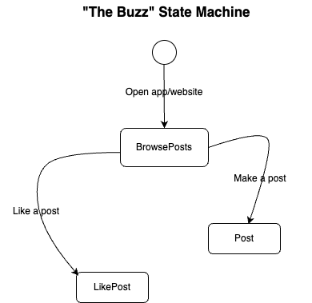
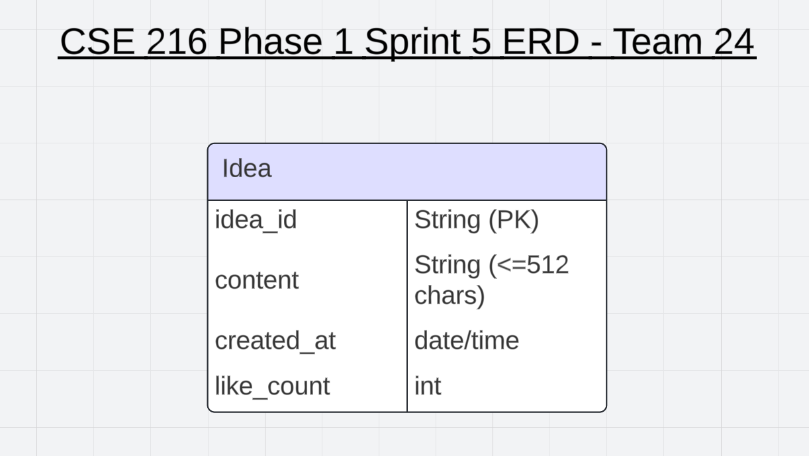

# User Stories and Tests

## **Anonymous User Stories**

### 1. As an anonymous user, I want to be able to like a post so that I can provide feedback to the post in ways that show my support.

- **Manual Test**:
  - **Test case**: Log in as an anonymous user, view a post, click the "like" button, and ensure the like is counted.
  - **Expected outcome**: The like button registers a response, the total like count increases, and the page reflects the new count.

### 2. As an anonymous user, I want to be able to browse posts so that I can view a variety of ideas.

- **Manual Test**:
  - **Test case**: Navigate through posts as an anonymous user and verify the ability to browse multiple posts without any restrictions.
  - **Expected outcome**: The user can seamlessly browse different posts and see different ideas without encountering any errors or blocks.

### 3. As an anonymous user, I want to be able to see how many likes are on each post, so that I can see the support for their idea.

- **Automated Test**:
  - **Test case**: Write a script that checks if each post on the page has a visible like count displayed.
  - **Expected outcome**: The script should validate that the like count is displayed for each post and is accurate.

### 4. As an anonymous user, I want to be able to make posts, so that I can share my ideas.

- **Manual Test**:
  - **Test case**: Log in as an anonymous user, attempt to create a post, and verify that the post gets published.
  - **Expected outcome**: The user should be able to submit the post successfully, and the post should appear in the list of posts.
---

## **Admin User Stories**

### 1. As an admin user, I want to be able to directly access posts, upload, delete, and edit posts so that I can share, enhance, or completely remove ideas/posts.

- **Manual Test**:
  - **Test case**: Log in as an admin user, navigate to the post management section, and perform the following actions:
    1. **Upload a post**: Verify that a new post can be created and displayed.
    2. **Delete a post**: Verify that a selected post can be removed from the list.
    3. **Edit a post**: Verify that an existing post can be updated and the changes are reflected.
  - **Expected outcome**: All actions (uploading, deleting, editing) should work without errors, and the updates should be reflected in real-time.

| Route | HTTP Method | Purpose | Request Format |
|-------|-------------|---------|----------------|
| /posts | GET | Retrieve all posts | N/A |
| /posts | POST | Create a new post | `{ "content": string }` |
| /posts/{id} | GET | Retrieve a specific post | N/A |
| /posts/{id}/like | PUT | Like a post | `{ "id": int }` |
| /posts/{id} | PUT | update a post | `{ "id": int, "content": string }` |

Backend Tests:

1. POST /ideas
* This test will check if a new idea can be successfully created by sending a valid JSON request. It should also verify that the idea is correctly stored in the database.

2. GET /ideas
* This test ensures that the server correctly retrieves a list of ideas from the database.

3. PUT /ideas/
/like
* This test checks if an idea can be successfully liked. It will make sure the like count is incremented for the given idea.

4. DELETE /ideas/
* Ensures that an idea can be deleted from the database.

5. Database Connection Test
* This test checks if the backend is able to establish a connection with the database.

Admin Tests:

1. Table Creation
* Test the functionality to create a new table in the database.

2. Add Entry to Table
* Ensures that the admin can add a new entry (idea) to the table. 

3. Delete Entry from Table
* Verifies that an admin can delete a specific entry (idea) from the database.

4. Table Drop Test
* Ensure that an admin can delete a database table when needed.

Web App tests:

1. Display Ideas on Page Load
* Ensures that the web app fetches and displays a list of ideas from the backend upon loading, showing both the ideas and the number of likes.

2. Post New Idea
* This test ensures that a new idea can be posted. After submission, the idea is posted to the backend and appears in the list of ideas.

3. Like Idea
* This test verifies the functionality of the "Like" button. When clicked, the like count should increase and the change should be reflected on the page. 

Mobile App tests:

1. Load Ideas List
* This test ensures that the mobile app fetches and displays a list of ideas from the backend.

2. Post New Idea
* Tests whether the user can post a new idea.

3. Like an Idea
* Ensures that the user can like an idea, and the UI is updated accordingly.

