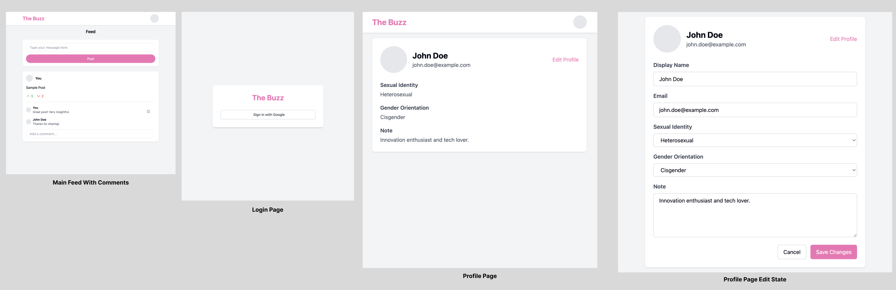
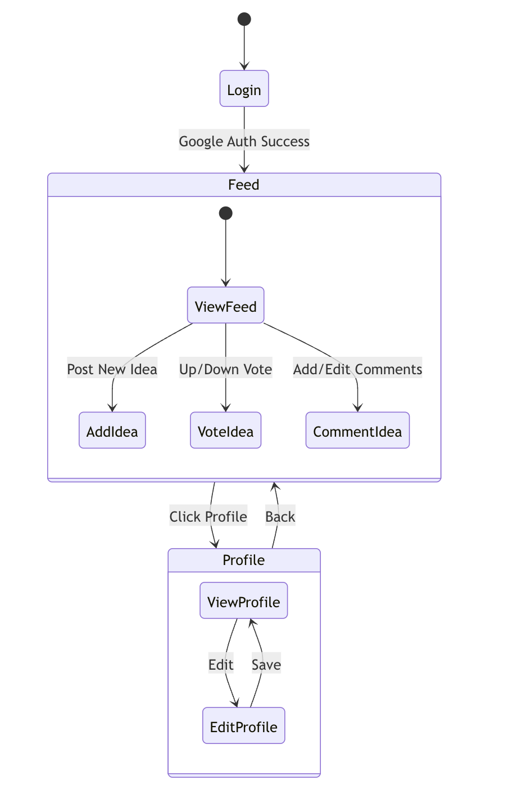
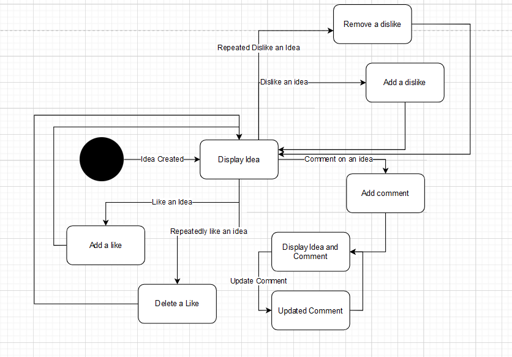
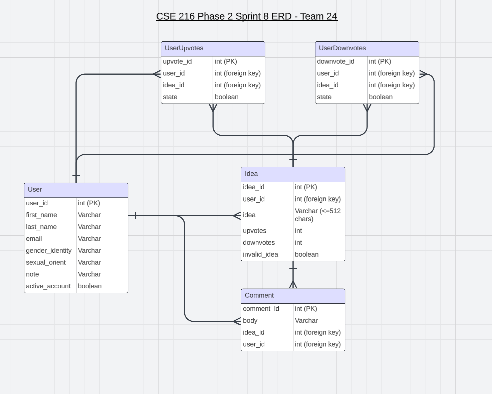

# User Stories and Tests

## **Authenticated User Stories**

### 1. As an authenticated user, I want to be able to log in using Google log-in so I can access my account.

- **Manual Test**:
  - **Test case**: Open the app and view and click on the Google log-in action button and ensure it goes through the process.
  - **Expected outcome**: After the button is clicked it will go through the Google log in process, and I am in my account, and the page shows I am in a logged in profile.

### 2. As an authenticated user, I want to be able to up-vote or down-vote any post, so that I can show my opinion in regards to the post.

- **Manual Test**:
  - **Test case**: Log in as an authenticated user and up-vote one post and down-vote another post, and check that both are counted.
  - **Expected outcome**: Both up-vote and down-vote button registers a response, and either the up-vote or down-vote increases, it is reflected on the page.

### 3. As an authenticated user, I want to be able to comment on a post, so that I can provide written feedback to a user’s post.

- **Manual Test**:
  - **Test case**: Log in as an authenticated user and press the comment button, and write a comment and post the comment.
  - **Expected outcome**: The comment button registers a response, allows for written text to be applied to the comment, allows it to be posted on the post, it is then subsequently reflected on the page under a comment section.

### 4. As an authenticated user, I want to be able to edit a comment I made previously, so that I can adjust and change parts or the whole of comment to better represent my feedback.

- **Manual Test**:
  - **Test case**: Log in as an authenticated user and view a post that I previously provided a comment for, press on a edit button on the comment, and then rewrite the comment and post the comment again.
  - **Expected outcome**: The edit button on the comment registers a response. It then allows for the user to change their text and comment, allows it to be posted again and then reflected on the page under the comment section.

### 5. As an authenticated user, I want to be able to create a user profile page and put my information in it, so that others that view my profile know more about me.

- **Manual Test**:
  - **Test case**: Log in as new anonymous user, view a page for creating a profile page, edit a section for Username, User’s email, User’s sexual orientation, User’s gender orientation, and a note from the user, i am able to write in any of this section when first created, and re-edit my user’s note field over and over again.
  - **Expected outcome**: After logging in with google, the page pops up for creating a profile page, then there's a button for each field to provide a description, that registers a response. The button to finish and submit the profile registers a response and posts. Then on my profile page If I am the owner the edit button for any description field registers a response and I am able to edit the description of that field and re-post.

### 6. As an authenticated user, I want to be able to click on the name of any user who posts a comment or a post, so that I can see the information regarding that user who posted.

- **Manual Test**:
  - **Test case**: Log in as an authenticated user, and press the name of someone who posted a comment or post, and then view their profile page.
  - **Expected outcome**: The Name of someone who posts registers a response once clicked, then a page pops up for the profile page of that user who posted.

### 7. As an authenticated user, I want to be able to view a navigation bar on the top of the page, and then have a button to click on my profile page, so that I can have easy access to view my profile page whenever I need to.

- **Manual Test**:
  - **Test case**: Log in as an authenticated user view the navigation bar, a script can be written to see if it is visible. Then I can click on my profile page button and open the profile page screen.
  - **Expected outcome**: The navigation bar is on the top and I am able to view it. I can also click on my profile page button and it registers a response, allowing for the profile page screen to show up.

### 8. As an authenticated user, I want any network errors to be reported to the user, so the user knows that due to network instability the app can not load.

- **Manual Test**:
  - **Test case**: Test by making a mock connection that is not working.
  - **Expected outcome**: The app should not be able to connect, and therefore a message will pop up that shows there is a network error.
---

## **Admin User Stories**

### 1. As an admin user, I want to be able to create a new comment and profile page, up-vote and downn-vote any post.

- **Manual Test**:
  - **Test case**: Log in as an Admin user, go to the post management section and profile page section and complete these tasks.
    1.  **Create a new comment:** Verify that a new comment can be created and displayed underneath a post.
    2.  **Edit a comment:** Verify that an existing comment can be updated and changes are reflected. 
    3.  **Create a new profile page:** Verify that a new profile can be created and displayed with the correct information in each element.
    4.  **Update a profile page:** Verify that an existing profile page can be updated and changes are reflected.
    5.  **Up-vote and Down-vote an idea:** Verify that an idea can be provided only one upvote or one down-vote and it is displayed on the idea itself.
  - **Expected outcome**: All actions (Creating a comment, editing a comment, creating a profile page, updating a profile page, and up-voting or down-voting) should work without any errors, and the updates should be reflected in real-time. 

### 2. As an admin user, I want to be able to invalidate a user or comment, so to improve user experience and to make the overall experience appropriate and professional.

- **Manual Test**:
  - **Test case**: Log in as an Admin user, go to the post management section and complete this tasks.
    1. **Hiding An Idea:** Verify that a comment can be put under a new hidden table where it can not be seen by non-Admin users, the changes should be reflected.
    2. **Deactivating An Account:** Verify that an account can be deleted/deactivated and that the changes are reflected.
  - **Expected outcome**: Both actions (Hiding an idea and deactivating an account) should work without any errors, and the updates should be reflected in real time.

### 3. As an admin user, I want to be able to use view function, to check and get information regarding different queries, so that I can understand how the app is being used.

- **Manual Test**:
  - **Test case**: Log in as Admin user go to the post management section and complete the following action
    1. **Create a VIEW:** Verify a selection of posts have come up who have more likes than the average user's post    
  - **Expected outcome**: Should be able to see a VIEW that has all posts that have higher likes than an average post's amount of likes

.png)

| Route | HTTP Method | Purpose | Request Format | Response Format |
|-------|-------------|---------|----------------|-----------------|
| /ideas | GET | Retrieve all ideas | N/A | `{ "mStatus": "ok", "mData": [list of ideas] }` |
| /ideas | POST | Create a new idea | `{ "content": string }` | `{ "mStatus": "ok", "mData": "Idea created successfully" }` |
| /ideas/{id} | GET | Retrieve a specific idea | N/A | `{ "mStatus": "ok", "mData": { idea details } }` |
| /ideas/{id} | DELETE | Delete an idea | N/A | `{ "mStatus": "ok", "mData": "deleted row" }` |
| /ideas/{id}/vote | POST | Up-votes or down-votes an idea | `{ "vote_type": string }` | `{ "mStatus": "ok", "mData": "Vote registered" }` |
| /ideas/{id}/comments | POST | Adds a new comment to an idea | `{ "content": string }` | `{ "mStatus": "ok", "mData": "Comment added" }` |
| /ideas/{id}/comments/{comment_id} | PUT | Allows user to edit their comment | `{ "content": string }` | `{ "mStatus": "ok", "mData": "Comment updated" }` |
| /profile | GET | Retrieves the user’s profile | N/A | `{ "mStatus": "ok", "mData": { profile details } }` |
| /profile/update | PUT | Updates the user's profile | `{ "field": string }` | `{ "mStatus": "ok", "mData": "Profile updated" }` |
| /users/{user_id}/profile | GET | Retrieves public profile for a specific user | N/A | `{ "mStatus": "ok", "mData": { public profile details } }` |
| /login | GET | Serve the login page with the OAuth link | N/A | `{"mStatus": "ok", "mData": "Redirect to OAuth server."}` |
| /auth/callback | GET | Handle the callback from Google and check token | N/A | `{"mStatus": "ok", "mData": "Session established"}` |
| /dashboard | GET | Serve the main content of the website | N/A | `{"mStatus": "ok", "mData": "Content loaded"}` |
| /logout | POST | Ends the user’s session | N/A | `{ "mStatus": "ok", "mData": "User logged out successfully" }` |

# Unit Test Descriptions for Project Roles

## Backend Unit Tests
1. **OAuth Authentication Tests**:
   - Test successful user authentication via Google Identity.

2. **Voting Logic Tests**:
   - Test route for up-voting an idea.
   - Test route for down-voting an idea.
   - Test the transition of votes when a user changes from up-vote to down-vote and vice versa.
   - Test the transition from up-vote/down-vote back to neutral.

3. **Comment Management Tests**:
   - Test the addition of comments to ideas.
   - Test the editing of existing comments.

4. **User Profile Management Tests**:
   - Test updating user profile information (name, gender identity, sexual orientation, note).
   - Test retrieval of user profile information.

## Web/ Mobile Unit Tests
1. **Login Page Tests**:
   - Test redirection to the profile page upon successful login.

2. **Voting Functionality Tests**:
   - Test the up-vote button functionality.
   - Test the down-vote button functionality.
   - Test that the voting state updates correctly in the UI.

3. **Comment Functionality Tests**:
   - Test the comment input functionality.
   - Test that comments can be edited.
   - Test that the comments section displays correctly.

4. **Profile Page Tests**:
   - Test rendering of the user profile page with correct data.
   - Test functionality for editing profile fields.

## Admin Unit Tests
1. **Database Management Tests**:
   - Test the creation of new database tables as per the updated ERD.
   
2. **Idea Management Tests**:
   - Test functionality for invalidating an idea.
   - Test that invalidated ideas do not appear in user views.

3. **User Management Tests**:
   - Test functionality for invalidating a user account.
   - Test that invalidated users cannot log in.

   # Backlog Items
   1. **SQL Prepared statements have hardcoded values. make these constant variables for safety.**
   2. **Refactor Database.java. It is 500+ lines. Can separate each function (update one, select one, etc.)**
   3. **Refractor widgets to be more modular**
   4. **Add delay when auto-refreshing to better catch changes in backend**
   5. **Refactor to use ViewModel/Model architecture to manage states and fetch data**
   6. **There can be more refactoring in backend like adding methods or classes.**