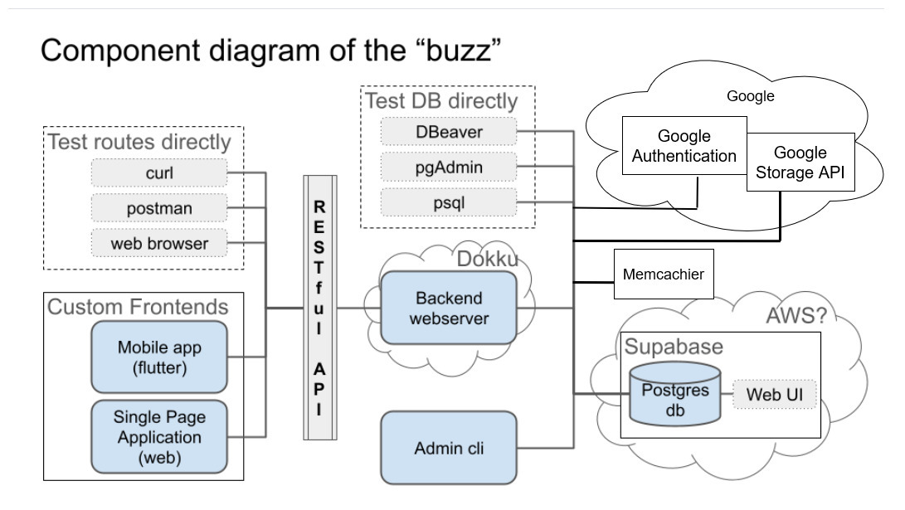
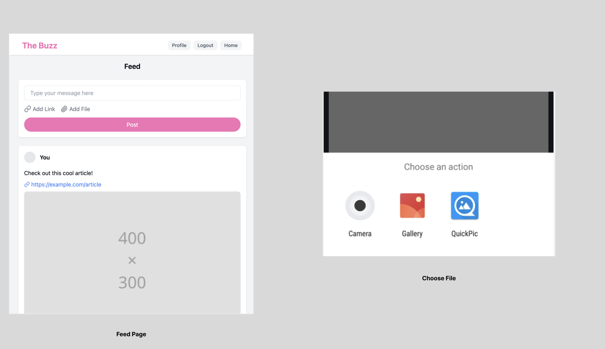
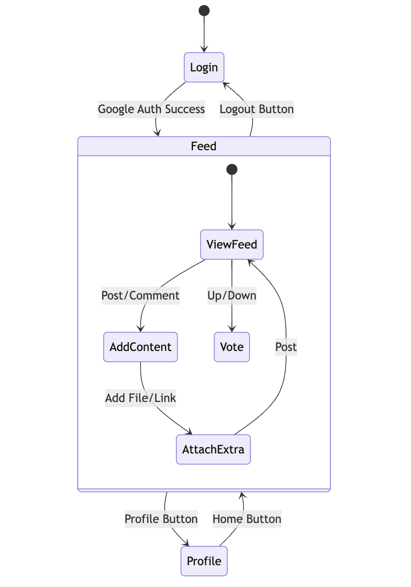
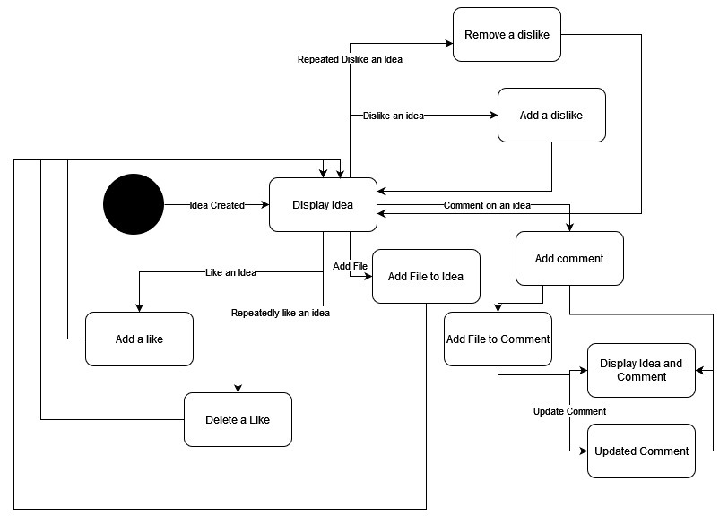
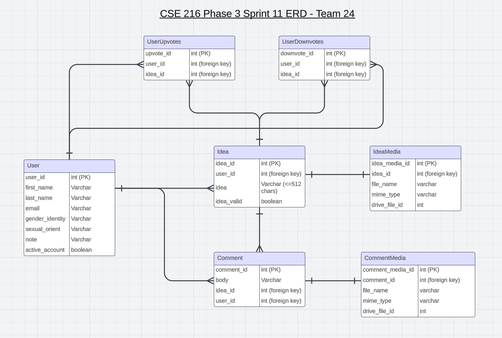

# User Stories and Tests

## **Authenticated User Stories**

### 1. As an authenticated user, I want to be able to log out, so that If necessary I have the ability to.

- **Manual Test**:
  - **Test case**: Login in and navigate to the profile page, then on the bottom press a logout button, which should make it so that I must log in again in the application.
  - **Expected outcome**: After the button is clicked it will bring me back to the login page and I will not be able to access my page until I login.

### 2. As an authenticated user, I want to be able to edit a comment I made previously, so that I can adjust and change parts or the whole of comment to better represent my feedback.

- **Manual Test**:
  - **Test case**: Log in as an authenticated user and view a post that I previously provided a comment for, press on a edit button on the comment, and then rewrite the comment and post the comment again.
  - **Expected outcome**: The edit button on the comment registers a response. It then allows for the user to change their text and comment, allows it to be posted again and then reflected on the page under the comment section.

### 3. As an authenticated user, I want to be able to create a user profile page and put my information in it, so that others that view my profile know more about me.

- **Manual Test**:
  - **Test case**: Log in as new anonymous user, view a page for creating a profile page, edit a section for Username, User’s email, User’s sexual orientation, User’s gender orientation, and a note from the user, i am able to write in any of this section when first created, and re-edit my user’s note field over and over again.
  - **Expected outcome**: After logging in with google, the page pops up for creating a profile page, then there's a button for each field to provide a description, that registers a response. The button to finish and submit the profile registers a response and posts. Then on my profile page If I am the owner the edit button for any description field registers a response and I am able to edit the description of that field and re-post.

### 4. As an authenticated user, I want to be able to click on the name of any user who posts a comment or a post, so that I can see the information regarding that user who posted.

- **Manual Test**:
  - **Test case**: Log in as an authenticated user, and press the name of someone who posted a comment or post, and then view their profile page.
  - **Expected outcome**: The Name of someone who posts registers a response once clicked, then a page pops up for the profile page of that user who posted.

### 5. As an authenticated user, I want any network errors to be reported to the user, so the user knows that due to network instability the app can not load.

- **Manual Test**:
  - **Test case**: Test by making a mock connection that is not working.
  - **Expected outcome**: The app should not be able to connect, and therefore a message will pop up that shows there is a network error.

### 6. As an authenticated user, I want to be able to post files, videos, photos, links, and other documents, so that I can provide more content to others.

- **Manual Test**:
  - **Test case**: Log in as an authenticated user and click on the post an idea button, click another button that allows for content to be uploaded, which opens the gallery to select a photo to upload, that photo is then subsequently attached to the idea or comment.
  - **Expected outcome**: Clicking the content button registers a response to open up the gallery app, which allows the user to select a photo or video to upload, once clicked is attached to the content and when posted registers a response to have the content attached.

### 7. As an authenticated user, I want to be able to take a photo in an app to upload a comment or an idea, to be able to get a quick photo or video and upload it immediately for others to see.

- **Manual Test**:
  - **Test case**: Log in as an authenticated user and click on the post an idea button, click another button that allows for a photo to be taken in-app, which opens the photo app, and once the photo is taken is then attached to the idea or comment.
  - **Expected outcome**: Clicking the photo icon registers a response to open up the photo app, which allows the user to take a photo, which then is attached to the content and registers a response to have the content attached in the post.

### 8. As an authenticated user, I want to be able to click on a link and it displays the content in the correct app, so that I do not have to manually navigate into another app.

- **Manual Test**:
  - **Test case**: Log in as an authenticated user and click on a link on an idea, which then brings me to the link.
  - **Expected outcome**: Clicking on a link on an idea should register a response as to open up the browser and then have it automatically look up the link.

### 9. As an authenticated user, I want my content to be stored in a local cache, to speed up the time it takes loading the content from the feed.

- **Manual Test**:
  - **Test case**: Return as an authenticated user on the application and look at the feed.
  - **Expected outcome**: The content should be present and displayed immediately without the need to reload the content.
---

## **Admin User Stories**

### 1. As an admin user, I want to be able to list the documents uploaded along with the person who uploaded it, and when they were last accessed, so that I can invalidate and/or remove old material to provide users the ability to upload whenever they need.

- **Manual Test**:
  - **Test case**: Login as Admin user go to the post management section and: 
    1. **View the Documents:** View a table that has the documents, along with the user's id, and the date of the last time it was accessed.
    2. **Remove Old Content:** Once I see old material and the storage has low space, I can delete old material from the table and from the drive.
  - **Expected outcome**: The content or documents are removed from storage and from the metadata on Supabase. And space on the storage increases.

  

  

  

  | Route | HTTP Method | Purpose | Request Format | Response Format |
|-------|-------------|---------|----------------|-----------------|
| /ideas | GET | Retrieve all ideas | N/A | `{ "mStatus": "ok", "mData": [list of ideas] }` |
| /ideas | POST | Create a new idea | `{ "content": string, "link": "string (optional)", "fileUrl": "string (optional)" }` | `{ "mStatus": "ok", "mData": "Idea created successfully" }` |
| /ideas/{id} | GET | Retrieve a specific idea | N/A | `{ "mStatus": "ok", "mData": { idea details } }` |
| /ideas/{id}/upvote | PUT | Up-votes or down-votes an idea | N/A | `{ "mStatus": "ok", "mData": ""incremented upvotes for row " + idx" }` |
| /ideas/{id}/downvote | PUT | Up-votes or down-votes an idea | N/A | `{ "mStatus": "ok", "mData": ""incremented upvotes for row " + idx" }` |
| /ideas/{id}/comments | POST | Adds a new comment to an idea | `{ "mIdea": string, "link": "string (optional)", "fileUrl": "string (optional)" }` | `{ "mStatus": "ok", "mData": "Comment added" }` |
| /comments/{comment_id} | PUT | Allows user to edit their comment | `{ "body": string }` | `{ "mStatus": "ok", "mData": "Comment updated" }` |
| /comments/{idea_id} | GET | Retrieve comments for specific idea | N/A | `{ "mStatus": "ok", "mData": { comments } }` |
| /profile/{user_id} | GET | Retrieves the user’s profile | N/A | `{ "mStatus": "ok", "mData": { profile details } }` |
| /profile/{id} | PUT | Updates the user's profile | `{ "field": string }` | `{ "mStatus": "ok", "mData": "Profile updated" }` |
| /dashboard | GET | Serve the main content of the website | N/A | `{"mStatus": "ok", "mData": [dashboard elements]}` |
| /login | POST | authenticate the user | `{"jwtToken": string}` | `{"mStatus": "ok", "mData": "Login succesful"}` |
| /logout | POST | Ends the user’s session | N/A | `{ "mStatus": "ok", "mData": "Logged out successfully" }` |
| /upload | POST | Allows user to upload a file/image | `{"data": data object}` | `{"mStatus": "ok","mData": {"fileUrl": "string"}}` |

# Unit Test Descriptions for Project Roles

## Backend Unit Tests
1. **OAuth Authentication Tests**:
   - Test successful user authentication via Google Identity.

2. **Voting Logic Tests**:
   - Test route for up-voting an idea.
   - Test route for down-voting an idea.
   - Test the transition of votes when a user changes from up-vote to down-vote and vice versa.
   - Test the transition from up-vote/down-vote back to neutral.

3. **Comment Management Tests**:
   - Test the addition of comments to ideas.
   - Test the editing of existing comments.

4. **User Profile Management Tests**:
   - Test updating user profile information (name, gender identity, sexual orientation, note).
   - Test retrieval of user profile information.

5. **File Upload Handling**:
   - Test that the backend accepts file uploads with the new /upload route.
   - Make sure the files are uploaded to Google Drive or Google Cloud Storage.

6. **Updated Routes**:
   - Test the updated route /ideas and confirm that the user can include a link with their post.
   - Test the updated /ideas/{id}/comments route and confirm the user can include a link with their comment.

## Web Unit Tests
1. **Login Page Tests**:
   - Test redirection to the profile page upon successful login.

2. **Voting Functionality Tests**:
   - Test the up-vote button functionality.
   - Test the down-vote button functionality.
   - Test that the voting state updates correctly in the UI.

3. **Comment Functionality Tests**:
   - Test the comment input functionality.
   - Test that comments can be edited.
   - Test that the comments section displays correctly.

4. **Profile Page Tests**:
   - Test rendering of the user profile page with correct data.
   - Test functionality for editing profile fields.

5. **File Upload Interface**:
   - Verify that users can select files using the file input and that the selected files are prepared for upload.

6. **Link Insertion Functionality**:
   - Verify that users can enter a URL as an optional field when creating a post or comment and that it is included in the submission.

7. **Displaying Uploaded Content**:
   - Verify that inserted links are clickable and open in a new tab.

## Mobile Unit Tests
1. **Login Page Tests**:
   - Test redirection to the profile page upon successful login.

2. **Voting Functionality Tests**:
   - Test the up-vote button functionality.
   - Test the down-vote button functionality.
   - Test that the voting state updates correctly in the UI.

3. **Comment Functionality Tests**:
   - Test the comment input functionality.
   - Test that comments can be edited.
   - Test that the comments section displays correctly.

4. **Profile Page Tests**:
   - Test rendering of the user profile page with correct data.
   - Test functionality for editing profile fields.

5. **Camera and Gallery Tests**:
   - Verify that the app can launch the camera, take a picture, and return the image to the app.
   - Make sure users can select existing images from the gallery.

6. **File Upload Functionality**:
   - Verify that images or files are correctly uploaded to the backend.
   - Make sure users can optionally post ideas or comments with links attached.

7. **Displaying Uploaded Content**:
   - Ensure that uploaded images are displayed correctly within ideas and comments.
   - Verify that non-image files are represented with clickable links.

## Admin Unit Tests
1. **Database Management Tests**:
   - Test the creation of new database tables as per the updated ERD.
   
2. **Idea Management Tests**:
   - Test functionality for invalidating an idea.
   - Test that invalidated ideas do not appear in user views.

3. **User Management Tests**:
   - Test functionality for invalidating a user account.
   - Test that invalidated users cannot log in.

4. **Content Management Features**:
   - Verify that the admin app can list all uploaded documents, including data such as owner and last access time.
   - Make sure an admin can delete or invalidate content, and that this action removes files from cloud storage and updates the database accordingly.
   - Confirm that the admin app correctly identifies content based on last access time.
